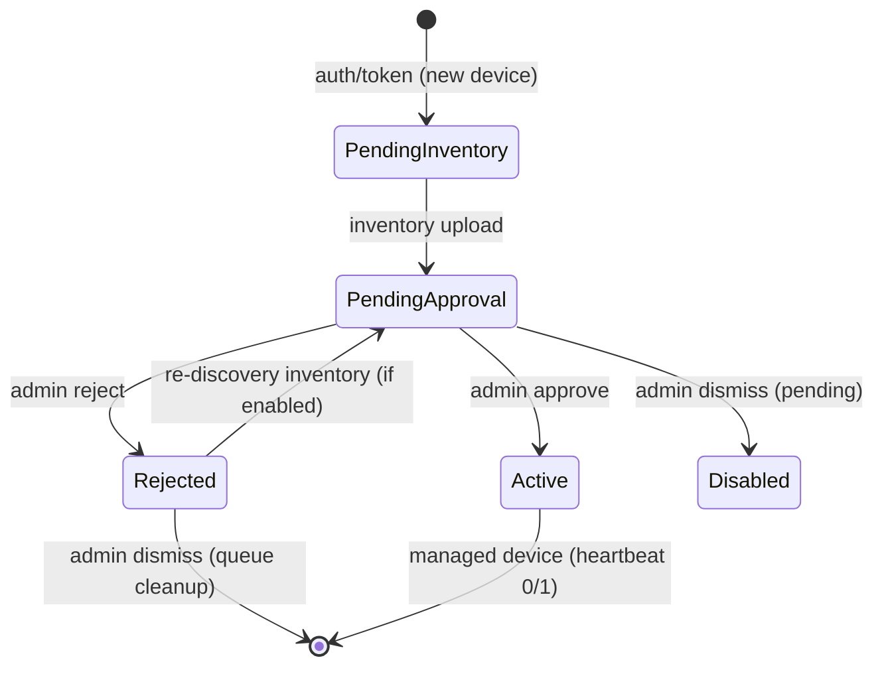

# Intellinode PostgreSQL Database

Single-schema setup for the Intellinode UEM agent–server platform.

## Application data schema (important)

The **C# API uses EF Core** and stores all application data in the **`intellinode` schema** only (`intellinode.devices`, `intellinode.device_inventory`, etc.).

| Source | Schema | Role |
|--------|--------|------|
| **EF Core migrations** (API startup) | `intellinode` | **Primary** — auth, enroll, heartbeat, inventory |
| `intellinode_full_setup.sql` | `intellinode` | Optional — extra PL/pgSQL functions, views, legacy SQL tests |
| Old EF public tables | `public` | **Obsolete** — drop with `cleanup_public_schema.sql` |

On startup, `DatabaseInitializer` runs `MigrateAsync()` and seeds the default tenant, Root group, and admin user.

### Fresh database (recommended)

1. Create database `intellinode`.
2. Start the API — EF applies migration `InitialIntellinodeSchema` to schema `intellinode`.
3. If you previously used public-schema tables, run `database/cleanup_public_schema.sql`.

### Existing database with `intellinode_full_setup.sql` already applied

If Section B of the SQL script already created `intellinode.*` tables, either:

- **Start the API** — `MigrationBootstrapper` creates `intellinode."__EFMigrationsHistory"` and baselines the initial migration automatically, or
- Run in pgAdmin on database **`intellinode`**:

```sql
-- See database/ensure_ef_migrations_history.sql
CREATE SCHEMA IF NOT EXISTS intellinode;

CREATE TABLE IF NOT EXISTS intellinode."__EFMigrationsHistory" (
    migration_id character varying(150) NOT NULL PRIMARY KEY,
    product_version character varying(32) NOT NULL
);

INSERT INTO intellinode."__EFMigrationsHistory" (migration_id, product_version)
VALUES ('20260523055049_InitialIntellinodeSchema', '10.0.1')
ON CONFLICT (migration_id) DO NOTHING;
```

Note: with `UseSnakeCaseNamingConvention()`, EF uses columns **`migration_id`** and **`product_version`** (not `MigrationId` / `ProductVersion`).

### Remove obsolete public tables

After confirming the API works against `intellinode.*`:

```powershell
psql -U postgres -h localhost -d intellinode -f database/cleanup_public_schema.sql
```

---

- PostgreSQL **15+**
- pgAdmin **or** `psql` on your PATH
- Superuser access (default: `postgres`)

## Connection

Matches `src/Intellinode.Api/appsettings.json`:

```
Host=localhost;Port=5432;Database=intellinode;Username=postgres;Password=postgres
```

Schema: `intellinode` (all tables, functions, and views live here).

## Run the setup

The script has two sections (A and B). Section A creates the database; Section B creates schema, tables, functions, and seed data. **Do not run the whole file against one database** — objects must be created inside `intellinode`.

### pgAdmin (recommended)

1. Open **Query Tool** connected to database **`postgres`**.
2. Highlight and execute **SECTION A** only (the `CREATE DATABASE` line near the top).
   - Error `42P04 already exists` is OK on re-runs.
3. In the object tree, connect to database **`intellinode`** (create it first via Section A if missing).
4. Open **Query Tool** on **`intellinode`**.
5. Highlight from the line `-- >>> SECTION B` through the end of the file and execute.

### psql (command line)

From the project root (`Intellinode/`), PowerShell:

```powershell
$env:PGPASSWORD = "postgres"
psql -U postgres -h localhost -c "CREATE DATABASE intellinode ENCODING 'UTF8'" 2>$null
$marker = '>>> SECTION B'
(Get-Content "database\intellinode_full_setup.sql" -Raw) -split [regex]::Escape($marker), 2 |
  Select-Object -Last 1 |
  psql -U postgres -h localhost -d intellinode -v ON_ERROR_STOP=1
```

Linux/macOS:

```bash
export PGPASSWORD=postgres
psql -U postgres -h localhost -c "CREATE DATABASE intellinode ENCODING 'UTF8'" 2>/dev/null || true
sed -n '/>>> SECTION B/,$p' database/intellinode_full_setup.sql | psql -U postgres -h localhost -d intellinode -v ON_ERROR_STOP=1
```

Section B is **idempotent**: it uses `IF NOT EXISTS` for schema/objects and `ON CONFLICT DO NOTHING` for seed rows.

## What the script creates

| Step | Contents |
|------|----------|
| Database | `intellinode` (UTF8) |
| Schema | `intellinode` |
| Extensions | `pgcrypto`, `uuid-ossp` |
| Tables | 13 tables (devices, tasks, inventory, admin, etc.) |
| Functions | Legacy FusionX heartbeat/discover procs as PL/pgSQL |
| Views | `vw_device_summary`, `vw_recent_heartbeats`, `vw_pending_tasks` |
| Seed | Default tenant, Root group, admin user |
| Role | `intellinode_app` (password: `change_me`) |

## Default admin login

| Field | Value |
|-------|-------|
| Username | `admin` |
| Password | `Admin@123` |

## Agent command codes

Returned by `fn_process_heartbeat` and related functions (legacy Windows agent contract):

| Code | Meaning |
|------|---------|
| `0` | No pending work |
| `1` | Tasks/commands pending — agent should fetch work |
| `SDFT` | Send Data First Time — upload full inventory |
| `2` | Legacy pending approval wire code (plain-text heartbeat only; FusionX Discover_Lookup_SDFT_ACK) |
| `exists` | Modern JSON pending approval — inventory received, awaiting admin approval |
| `NOK` | Error |

## Enrollment states (`intellinode.enrollment_state`)

Used on `devices.enrollment_state` and referenced by agent self-discovery flows:

| Value | Meaning |
|-------|---------|
| `PendingInventory` | Device enrolled; awaiting first inventory upload (SDFT) |
| `Active` | Device is licensed and operational |
| `Unlicensed` | Device exceeds license capacity |
| `Disabled` | Device administratively disabled |
| `PendingApproval` | Inventory received; awaiting admin approval (self-discovery) |
| `Rejected` | Admin rejected self-discovery for this device |

## Discover lookup (`intellinode.discover_lookup`)

Queue table for agent self-discovery. One row per tenant/MAC pair (unique on `tenant_id`, `mac_address`).

| Column | Type | Description |
|--------|------|-------------|
| `id` | UUID | Primary key |
| `tenant_id` | UUID | Owning tenant |
| `device_id` | UUID? | Linked device after registration |
| `mac_address` | VARCHAR(300) | Agent MAC address |
| `host_name` | VARCHAR(255) | Reported hostname |
| `ip_address` | VARCHAR(64) | Reported IP |
| `domain` | VARCHAR(255) | Reported domain |
| `os_name` | VARCHAR(64) | OS name |
| `os_version` | VARCHAR(64) | OS version |
| `agent_version` | VARCHAR(64) | Agent version |
| `discovery_type` | VARCHAR(64) | Discovery source (default `AgentSelfDiscovery`) |
| `status` | `discover_lookup_status` | Approval state (see below) |
| `discovered_utc` | TIMESTAMPTZ | When the device was first discovered |
| `updated_utc` | TIMESTAMPTZ | Last update timestamp |
| `approved_by_admin_id` | UUID? | Admin who approved |
| `approved_utc` | TIMESTAMPTZ? | Approval timestamp |
| `rejected_by_admin_id` | UUID? | Admin who rejected |
| `rejected_utc` | TIMESTAMPTZ? | Rejection timestamp |
| `rejection_reason` | VARCHAR(500)? | Reason for rejection |
| `notes` | VARCHAR(1000)? | Admin notes |

### Discover lookup status (`intellinode.discover_lookup_status`)

| Value | Meaning |
|-------|---------|
| `Pending` | Awaiting admin review |
| `Approved` | Admin approved; device may proceed to active enrollment |
| `Rejected` | Admin rejected self-discovery |

Legacy SQL setup used a `lookup_status` VARCHAR column (`Pending`, `Registered`). Migrations and the setup script map `Registered` → `Approved`.

Legacy Active devices enrolled before self-discovery PRs are backfilled by migration `20260528120000_BackfillDiscoverLookupForActiveDevices` with `discovery_type = 'LegacyActive'` and `status = Approved`.

## Admin discover REST API

All endpoints require admin JWT (`Authorization: Bearer {accessToken}`) with role `Admin`. Base path: `/api/v1/admin/discover`.

### Enrollment flow (self-discovery)



| Step | Agent action | Server state | Heartbeat flag |
|------|--------------|--------------|----------------|
| 1 | `POST /agents/auth/token` | `PendingInventory` | — |
| 2 | `POST /agents/heartbeat` | no inventory | `SDFT` |
| 3 | `POST /agents/inventory` | `PendingApproval` + `discover_lookup.Pending` | — |
| 4 | `POST /agents/heartbeat` | awaiting admin | `exists` |
| 5 | Admin `POST .../approve` | `Active` + `discover_lookup.Approved` | — |
| 6 | `POST /agents/heartbeat` | managed | `0` or `1` |

Token enrollment (`POST /agents/windows/register`) skips the queue and sets `Active` immediately.

### Endpoints

| Method | Path | Description |
|--------|------|-------------|
| `GET` | `/api/v1/admin/discover` | Paginated list (`status`, `search`, `page`, `pageSize`, `sortBy`, `sortDir`) |
| `GET` | `/api/v1/admin/discover/stats` | Pending count and today’s approved/rejected counts |
| `GET` | `/api/v1/admin/discover/{macAddress}` | Detail with parsed inventory JSON |
| `POST` | `/api/v1/admin/discover/{macAddress}/approve` | Approve pending discovery → device `Active` |
| `POST` | `/api/v1/admin/discover/{macAddress}/reject` | Reject pending discovery → device `Rejected`, revoke tokens |
| `POST` | `/api/v1/admin/discover/bulk-approve` | Batch approve by MAC list |
| `DELETE` | `/api/v1/admin/discover/{macAddress}` | Dismiss queue entry (Pending or Rejected only) |

### Error codes

| HTTP | `error` | When |
|------|---------|------|
| 404 | `DiscoveryNotFound` | No `discover_lookup` row for MAC |
| 404 | `GroupNotFound` | Approve with invalid `groupId` |
| 409 | `DiscoveryAlreadyProcessed` | Approve/reject/dismiss on non-pending, or dismiss on Approved |
| 409 | `InventoryMissing` | Approve before inventory uploaded |
| 403 | `DeviceRejected` | Inventory on rejected device when `AllowReDiscoveryAfterReject=false` |
| 403 | `DevicePendingApproval` | Agent config/tasks while awaiting approval |

### Dismiss behavior

- **Pending**: deletes `discover_lookup` row, sets device `Disabled`, revokes refresh tokens
- **Rejected**: deletes `discover_lookup` row only (device stays `Rejected`)
- **Approved**: not allowed (409)

### Audit logging

Discovery lifecycle events are written to `intellinode.agent_communication_logs` (`command_code`: `SDFT`, `exists`, `PendingApproval`, `Approved`, `Rejected`, `Dismissed`). Normal Active heartbeats (`0`/`1`) are not logged.

### Exception logging

Unexpected API and infrastructure errors are persisted to `intellinode.exception_logs` (`source`, `message`, `stack_trace`, optional `request_path` / `http_method`, optional `device_id` / `admin_id`, `logged_utc`). Serilog also records the same events. Query recent rows:

```sql
SELECT source, message, logged_utc
FROM intellinode.exception_logs
ORDER BY logged_utc DESC
LIMIT 20;
```

### Configuration (`AgentDiscovery` in appsettings)

| Setting | Default | Purpose |
|---------|---------|---------|
| `RequireAdminApproval` | `true` | Self-discovery inventory enters pending queue |
| `AllowReDiscoveryAfterReject` | `true` | Rejected devices may upload inventory again |
| `PendingDiscoveryRetentionDays` | `90` | Retention hint for future stale-row cleanup |

## Quick function tests

After setup, connect to database **`intellinode`** and run:

```sql
SET search_path TO intellinode, public;

-- Register a test device
SELECT fn_register_device(
    '00000000-0000-0000-0000-000000000001'::uuid,
    'AA:BB:CC:DD:EE:FF',
    'TEST-PC'
);

-- First heartbeat → SDFT (no inventory yet)
SELECT fn_process_heartbeat('AA:BB:CC:DD:EE:FF', '01:00:00');

-- Upload inventory, then heartbeat → 0
SELECT fn_upsert_device_inventory(
    fn_get_device_by_mac('00000000-0000-0000-0000-000000000001'::uuid, 'AA:BB:CC:DD:EE:FF'),
    '{"cpu":"Intel"}'::jsonb, '{}'::jsonb, '{}'::jsonb, '{}'::jsonb
);
SELECT fn_process_heartbeat('AA:BB:CC:DD:EE:FF', '01:05:00');

-- Queue a task → heartbeat returns 1
SELECT fn_queue_device_task(
    fn_get_device_by_mac('00000000-0000-0000-0000-000000000001'::uuid, 'AA:BB:CC:DD:EE:FF'),
    'Shutdown', 'Shutdown', '', 42
);
SELECT fn_process_heartbeat('AA:BB:CC:DD:EE:FF', '01:10:00');
```

## Windows 802.1X settings

Per-device 802.1X profiles are stored in `intellinode.device_windows_802_1x_settings` (`settings_json` JSONB). Agent tasks use compact `{"settingsVersion":N}` references; the API hydrates full payloads at poll time (ADR Option A).

Operational guide: [docs/windows-802-1x-operations.md](../docs/windows-802-1x-operations.md).

## FusionX → PostgreSQL mapping

| Legacy FusionX | PostgreSQL function |
|----------------|---------------------|
| `OnlyHeartBitproc_TCS` | `fn_process_heartbeat` |
| `OnlyHeartBitManageAck_TCS_Windows` | `fn_process_heartbeat_ack` |
| `PRC_HBT_Details` | `fn_heartbeat_binding_ip` |
| `PRC_HBT_Details_HostName` | `fn_heartbeat_binding_hostname` |
| `XP_prcUpdateIPAddress` | `fn_update_device_ip_address` |
| `CheckDiscoverLookupEntry` | `fn_check_discover_lookup` |

## App connection string tip

Add schema search path for direct SQL/ORM access:

```
Host=localhost;Port=5432;Database=intellinode;Username=postgres;Password=postgres;Search Path=intellinode,public
```

For production, use the `intellinode_app` role and change its password after setup:

```sql
ALTER ROLE intellinode_app WITH PASSWORD 'your_secure_password';
```
