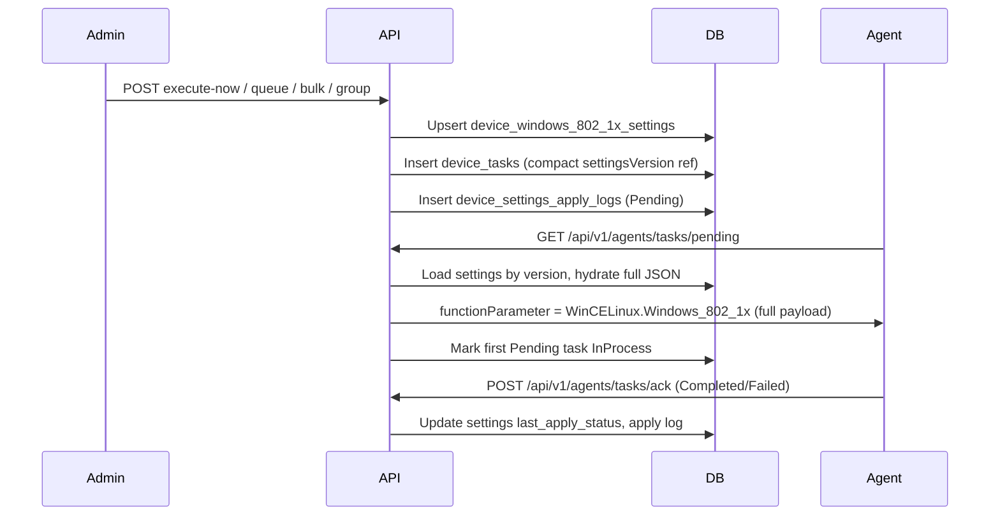

# Windows 802.1X Security — Operations Guide

## 4.1 Overview

Intellinode exposes REST APIs for **Windows 802.1X Security** on **Windows `:XP` devices only** (v1). Admins configure PEAP/TLS/wired profiles via JSON that mirrors FusionX `structXP_Data.cs` field names.

**FusionX parity**

| Concept | Value |
|---------|-------|
| Module name | `Windows_802_1x` |
| Instant function | `Now` |
| Queued function | `Update` |
| Agent signal (`extra_data`) | `{macAddress}&Win802_1x` (configurable suffix) |

**ADR Option A (binding):** Full settings live in `device_windows_802_1x_settings.settings_json` (JSONB). Task rows store a compact reference `{"settingsVersion":N}` in `device_tasks.function_parameter`. The server **hydrates** the full `{"WinCELinux":{"Windows_802_1x":{...}}}` payload when the agent polls pending tasks.

See [ADR-0001](adr/0001-windows-802-1x-payload-strategy.md) for measured payload sizes (min ~3,494 chars, max ~11,809 chars).

---

## 4.2 API reference (admin)

Base path: `/api/v1/admin/device-config/windows-802-1x`

| Method | Path | Description |
|--------|------|-------------|
| GET | `/{macAddress}` | Current settings (**password redacted** on GET) |
| GET | `/apply-history/{macAddress}` | Apply history (module-scoped) |
| POST | `/execute-now` | Single instant apply |
| POST | `/execute-now/bulk` | Bulk instant apply (MAC list) |
| POST | `/execute-now/group/{groupId}` | Group instant apply (expand group → devices) |
| POST | `/queue` | Queued apply (single device) |

**Common error codes**

| Code | HTTP | Meaning |
|------|------|---------|
| `FeatureDisabled` | 404 | `Windows8021x:Enabled=false` or `ReadOnly=true` on writes |
| `DeviceNotFound` | 404 | MAC not enrolled in tenant |
| `GroupNotFound` | 404 | Group id invalid (group endpoint only) |
| `ApplyBlocked` | 409 | Pending/InProcess `Windows_802_1x` task or enrollment not managed |
| `ValidationFailed` | 400 | FluentValidation or JSON shape failure |
| `LegacyBehaviorExecutionFailed` | 502 | Unexpected service error |

Bulk and group endpoints return **HTTP 200** when orchestration succeeds, even if some targets are blocked (per-target `Results` carry `Blocked` + `Reason`).

---

## 4.3 Configuration (`appsettings.json` → `Windows8021x`)

| Setting | Default | Purpose |
|---------|---------|---------|
| `Enabled` | `true` | Master switch |
| `ReadOnly` | `false` | Blocks writes (execute-now, queue, bulk, group) |
| `LegacySummaryEnabled` | `true` | FusionX HTML summary in responses |
| `DefaultSignalSuffix` | `Win802_1x` | Appended to `extra_data` as `{mac}&{suffix}` |

---

## 4.4 Agent pipeline



**Numbered flow**

1. Admin queues work → DB stores compact `function_parameter`.
2. Agent polls `GET /api/v1/agents/tasks/pending` → server hydrates full JSON (includes raw `cPassword`).
3. Agent applies profile on device.
4. Agent acks `POST /api/v1/agents/tasks/ack` → settings `pending_apply` cleared, apply log terminal status set.

---

## 4.5 Troubleshooting

| Symptom | Likely cause | Action |
|---------|--------------|--------|
| Agent receives `{"settingsVersion":N}` not full JSON | Hydration failed (stale version) | Verify `device_windows_802_1x_settings.settings_version` matches task ref |
| `ApplyBlocked` / `PendingTaskExists` | Pending/InProcess `Windows_802_1x` task | Wait for agent ack or clear stuck task |
| Password missing on device | Agent never polled hydrated task | Check task status + agent connectivity/logs |
| GET shows `********` but apply fails | Expected — GET is redacted | Verify `settings_json` in DB contains real password |
| Bulk target `Blocked` / `UnsupportedOsType` | Non-`:XP` device in group | v1 is Windows XP only; use supported MAC suffix |
| Bulk target `Blocked` / `EnrollmentStateBlocked` | Device not managed | Check `devices.enrollment_state` |

---

## 4.6 SQL debugging snippets

```sql
-- Settings row
SELECT device_id, settings_version, pending_apply, last_apply_status, last_applied_version
FROM intellinode.device_windows_802_1x_settings
WHERE device_id = '...';

-- Pending 802.1x tasks
SELECT id, module_name, function_name, function_parameter, status, extra_data, created_utc
FROM intellinode.device_tasks
WHERE device_id = '...' AND module_name = 'Windows_802_1x'
ORDER BY created_utc DESC;

-- Apply logs
SELECT settings_kind, settings_version, apply_mode, status, message, created_utc
FROM intellinode.device_settings_apply_logs
WHERE device_id = '...' AND settings_kind = 'Windows8021x'
ORDER BY created_utc DESC;
```

---

## 4.7 Security notes (from ADR)

- Admin **GET** redacts `cPassword` (`********`); write path stores the real password in `settings_json` for agent delivery.
- Recommend **TDE/encryption at rest** for production PostgreSQL (implementation deferred).
- **Stale version race:** task is bound to `settingsVersion` at queue time; if settings are overwritten before poll, hydrator returns compact ref (agent should re-poll after new task).

---

## 4.8 Explicitly deferred (v2+)

- Linux 802.1X (`:LX`, `:CE`)
- **Group-level 802.1X template + `InheritFromGroup`** (like `GroupRemoteSettings`) — v1 group apply only expands members and applies shared JSON
- Certificate/EKU lookup APIs
- Settings version snapshots for historical payload reconstruction
- Widening `device_tasks.function_parameter` column (Option B fallback)
- Bulk **queue** endpoint (bulk is execute-now only in v1)

---

## 4.9 Related documentation

- [ADR-0001: Windows 802.1X Agent Payload Strategy](adr/0001-windows-802-1x-payload-strategy.md)
- HTTP samples: `src/Intellinode.Api/Intellinode.Api.http` (Windows 802.1X section)
