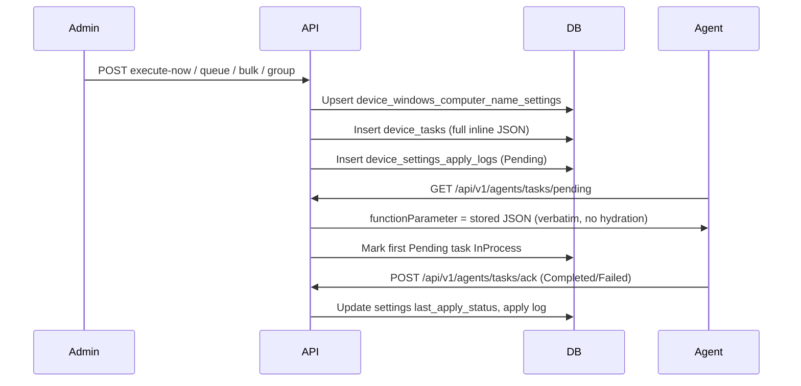

# Windows Computer Name / Domain Join — Operations Guide

## 4.1 Overview

Intellinode exposes REST APIs for **Windows Computer Name / Domain Join** on **Windows `:XP` devices only** (v1). Admins configure host rename or domain/workgroup join via JSON that mirrors FusionX `WindowsComputerNameSettings` and `WindowsDomainSettings` struct field names.

**FusionX parity**

| Concept | Host rename | Domain / workgroup join |
|---------|-------------|---------------------------|
| Module name | `Host Name` | `DomainSettings` |
| Instant function | `Now` | `Now` |
| Queued function | `Update` | `Update` |
| Agent signal (`extra_data`) | `{macAddress}&CN` | `{macAddress}&CN` |
| Wrapper key | `WindowsComputerNameSettings` | `WindowsDomainSettings` |

**ADR Option A (binding):** Full settings JSON is stored inline in `device_tasks.function_parameter` (≤512 chars after validation). The server **does not hydrate** on agent poll — the agent receives the same JSON written at queue time.

See [ADR-0002](adr/0002-windows-computer-name-payload-strategy.md) for measured payload sizes (typical host rename ~300 chars; domain join with OU ~400–500 chars).

**Contrast with 802.1X:** 802.1X stores a compact `settingsVersion` reference and hydrates on poll; Computer Name stores the complete payload inline (Keyboard parity).

---

## 4.2 API reference (admin)

Base path: `/api/v1/admin/device-config/windows-computer-name`

| Method | Path | Description |
|--------|------|-------------|
| GET | `/{macAddress}` | Current settings (**password redacted** on GET) |
| GET | `/apply-history/{macAddress}` | Apply history (module-scoped) |
| POST | `/execute-now` | Single instant apply |
| POST | `/execute-now/bulk` | Bulk instant apply (MAC list) |
| POST | `/execute-now/group/{groupId}` | Group instant apply (expand group → devices) |
| POST | `/queue` | Queued apply (single device) |

**Common error codes**

| Code | HTTP | Meaning |
|------|------|---------|
| `FeatureDisabled` | 404 | `WindowsComputerName:Enabled=false` or `ReadOnly=true` on writes |
| `DeviceNotFound` | 404 | MAC not enrolled in tenant (single-device endpoints) |
| `GroupNotFound` | 404 | Group id invalid (group endpoint only) |
| `ApplyBlocked` | 409 | Pending/InProcess task for the **same module name** or enrollment not managed |
| `ValidationFailed` | 400 | FluentValidation, payload >512, or hostname rules |
| `LegacyBehaviorExecutionFailed` | 502 | Unexpected service error |

Bulk and group endpoints return **HTTP 200** when orchestration succeeds, even if some targets are blocked (per-target `Results` carry `Blocked` + `Reason`).

**Bulk/group per-target block reasons**

| Reason | Meaning |
|--------|---------|
| `DeviceNotFound` | MAC not in tenant (bulk only) |
| `UnsupportedOsType` | MAC suffix is not `:XP` |
| `EnrollmentStateBlocked` | Device not in managed `Active` enrollment |
| `PendingTaskExists` | Pending/InProcess task for same module (`Host Name` or `DomainSettings`) |
| `HostNameNotUnique` | Auto-generate could not produce a unique name (≤20 suffix attempts) |
| `PayloadTooLarge` | Resolved inline JSON exceeds 512 chars |

---

## 4.3 Configuration (`appsettings.json` → `WindowsComputerName`)

| Setting | Default | Purpose |
|---------|---------|---------|
| `Enabled` | `true` | Master switch |
| `ReadOnly` | `false` | Blocks writes (execute-now, queue, bulk, group) |
| `LegacySummaryEnabled` | `true` | FusionX HTML summary in responses |
| `DefaultSignalSuffix` | `CN` | Appended to `extra_data` as `{mac}&{suffix}` |

---

## 4.4 Agent pipeline



**Numbered flow**

1. Admin queues work → DB stores full `function_parameter` JSON (≤512 chars).
2. For bulk/group with empty `hostName` and auto-generate metadata, the **server resolves a concrete hostname per device** before queue (entity + task payload both contain the resolved name).
3. Agent polls `GET /api/v1/agents/tasks/pending` → server returns stored JSON unchanged.
4. Agent applies rename/domain join on device.
5. Agent acks → settings `pending_apply` cleared, apply log terminal status set.

**Per-module pending block:** A pending `Host Name` task does not block `DomainSettings` (and vice versa). Bulk/group honor the same rule per target.

---

## 4.5 Auto-generate hostnames (FusionX parity)

When `hostName` is empty and auto-generate metadata is present (`prefix`, `postfix`, `noOfChar`, `isMacOrSerial`):

| Input | Behavior |
|-------|----------|
| `noOfChar` | Clamped 1–15; defaults to **12** when 0 |
| `isMacOrSerial == false` | Last `noOfChar` characters of MAC (colons/dashes stripped, uppercase) |
| `isMacOrSerial == true` | Serial from `device_inventory.hardware_json` (`serialNumber`, `SerialNumber`, …); **falls back to MAC segment** if missing |
| `prefix` / `postfix` | Joined as `{prefix}-{middle}-{postfix}` when segments are non-empty (FusionX `StringBuilder` pattern) |
| NetBIOS limit | Final name truncated to **15 characters** |
| Uniqueness | Tenant-scoped check against `devices.host_name` and `device_windows_computer_name_settings.host_name`; on collision append `-2`, `-3`, … up to 20 attempts |

Bulk/group responses include `resolvedHostName` per accepted target when auto-generate ran.

---

## 4.6 Troubleshooting

| Symptom | Likely cause | Action |
|---------|--------------|--------|
| `ApplyBlocked` / `PendingTaskExists` | Pending/InProcess task for same module | Wait for agent ack or clear stuck task; other module may still apply |
| Bulk target `Blocked` / `UnsupportedOsType` | Non-`:XP` MAC in list or group | v1 is Windows XP only |
| Bulk target `Blocked` / `EnrollmentStateBlocked` | Device not managed | Check `devices.enrollment_state = Active` |
| `HostNameNotUnique` after auto-generate | Tenant hostname collision exhausted suffix attempts | Free conflicting names or set explicit `hostName` |
| `ValidationFailed` / payload >512 | Domain join JSON too large (long OU/password) | Shorten OU path or credentials; see ADR-0002 spike |
| Agent receives empty `HostName` | Legacy path without server resolution | Use bulk/group or single execute-now; server resolves before queue |
| GET shows `********` but apply fails | Expected — GET redacts password | Verify DB entity stores real password for agent delivery |
| Signal empty in poll DTO | Known `ExtractSignal` limitation for MACs with colons | Verify `device_tasks.extra_data` ends with `&CN` in DB |

---

## 4.7 SQL debugging snippets

```sql
-- Settings row
SELECT device_id, settings_version, host_name, prefix, postfix, no_of_char, is_mac_or_serial,
       pending_apply, last_apply_status, password IS NOT NULL AS has_password
FROM intellinode.device_windows_computer_name_settings
WHERE device_id = '...';

-- Pending computer name tasks (both modules)
SELECT id, module_name, function_name, function_parameter, status, extra_data, created_utc
FROM intellinode.device_tasks
WHERE device_id = '...'
  AND module_name IN ('Host Name', 'DomainSettings')
ORDER BY created_utc DESC;

-- Apply logs
SELECT settings_kind, settings_version, apply_mode, status, message, created_utc
FROM intellinode.device_settings_apply_logs
WHERE device_id = '...' AND settings_kind = 'WindowsComputerName'
ORDER BY created_utc DESC;
```

---

## 4.8 Security notes (from ADR)

- Admin **GET** redacts `password` (`********`); write path stores the real password in the entity and inline agent payload.
- Recommend **TDE/encryption at rest** for production PostgreSQL (implementation deferred).
- Password travels in `function_parameter` to the agent (inline JSON, no hydration).

---

## 4.9 Explicitly deferred (v2+)

- Linux Computer Name (`:LX`, `:CE`)
- **Bulk queue** endpoint (bulk/group are execute-now only in v1)
- **Group-level Computer Name template + `InheritFromGroup`** (like `GroupRemoteSettings`) — v1 group apply only expands members and applies shared JSON
- Full FusionX stored-proc serial lookup (`getSerialNumberByMac`) — v1 uses inventory JSON with MAC fallback
- Widening `device_tasks.function_parameter` column (Option B fallback)
- Agent-side auto-generate from metadata (v1 resolves server-side per device)

---

## 4.10 Related documentation

- [ADR-0002: Windows Computer Name Agent Payload Strategy](adr/0002-windows-computer-name-payload-strategy.md)
- HTTP samples: `src/Intellinode.Api/Intellinode.Api.http` (Windows Computer Name section)
