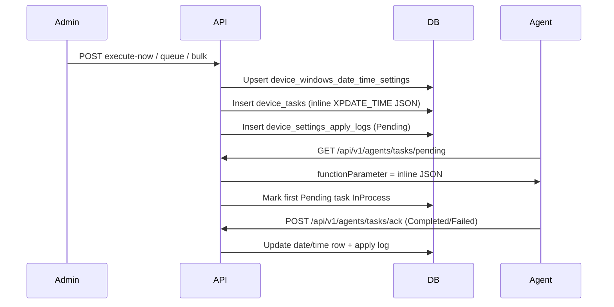

# Windows Date & Time Setup — Operations Guide

## 1. Overview

Intellinode exposes REST APIs for **Windows Date & Time Setup** on **Windows `:XP` devices only** (v1). Admins configure **manual date/time**, **time zone**, or **NTP time server** — the FusionX **System Settings → Time and Language → Date & Time** screen (three tabs).

| Concept | Value |
|---------|-------|
| FusionX UI | System Settings → **Time and Language** → Date & Time |
| Desired storage | `device_windows_date_time_settings` (1 row/device) |
| Settings kind (apply logs) | `WindowsDateTimeSetup` |
| Reference time zones | `GET /api/v1/admin/device-config/time-and-language/reference/time-zones` (PR1) |

Three apply modes map to **separate FusionX module names** (independent pending-task blocking per tab):

| `WindowsDateTimeApplyMode` | FusionX `module_name` | Signal suffix (default) |
|----------------------------|----------------------|-------------------------|
| `ManualDateTime` | `DateTime` | `DT` |
| `TimeZone` | `TimeZone` | `TZ` |
| `TimeServer` | `TimeServerSynchro` | `TS` |

---

## 2. FusionX parity

| Item | Value |
|------|-------|
| Agent struct | `WinCELinux.XPDATE_TIME` |
| Payload wrapper | `{ "WinCELinux": { "XPDATE_TIME": { ... } } }` |
| Instant function | `"Now"` |
| Queued function | `"Update"` |
| Payload delivery | **Inline JSON** in `device_tasks.function_parameter` (≤512 chars) |
| `TaskID` in payload | Legacy numeric task id (`device_tasks.legacy_task_id`) |
| `AgentAction` | From request `execution.agentAction` (default `0`) |

**Example payloads (fields populated per active tab only):**

Manual date/time:

```json
{
  "WinCELinux": {
    "XPDATE_TIME": {
      "strTimeZone": "",
      "DtDate": "2026-06-11T00:00:00",
      "DtTime": "2026-06-11T14:30:00",
      "TimeServer": "",
      "MUI_Display": "",
      "TaskID": 42,
      "AgentAction": 0
    }
  }
}
```

Time zone:

```json
{
  "WinCELinux": {
    "XPDATE_TIME": {
      "strTimeZone": "(UTC+05:30) Chennai, Kolkata, Mumbai, New Delhi",
      "DtDate": "",
      "DtTime": "",
      "TimeServer": "",
      "MUI_Display": "490",
      "TaskID": 43,
      "AgentAction": 0
    }
  }
}
```

Time server:

```json
{
  "WinCELinux": {
    "XPDATE_TIME": {
      "strTimeZone": "",
      "DtDate": "",
      "DtTime": "",
      "TimeServer": "time.windows.com",
      "MUI_Display": "",
      "TaskID": 44,
      "AgentAction": 0
    }
  }
}
```

---

## 3. API reference (admin)

Base path: `/api/v1/admin/device-config/windows-date-time`

| Method | Path | Description |
|--------|------|-------------|
| GET | `/{macAddress}` | Current desired settings + version/apply status |
| GET | `/apply-history/{macAddress}` | Apply history (`status`, `page`, `pageSize`, `fromUtc`, `toUtc`) |
| POST | `/execute-now` | Instant apply (`scheduleType`: `InstantApply`) |
| POST | `/queue` | Scheduled apply (`scheduleType`: `Queue`) |
| POST | `/execute-now/bulk` | Instant apply same settings to many MACs |
| POST | `/execute-now/group/{groupId}` | Instant apply to active group members |

**Common error codes**

| Code | HTTP | Meaning |
|------|------|---------|
| `FeatureDisabled` | 404 | `WindowsDateTime:Enabled=false` or `ReadOnly=true` on writes |
| `DeviceNotFound` | 404 | MAC not enrolled in tenant |
| `ApplyBlocked` | 409 | Pending/InProcess task for the **same** `module_name`, or enrollment not managed |
| `ValidationFailed` | 400 | FluentValidation, invalid time zone master row, or payload >512 chars |
| `GroupNotFound` | 404 | Group id invalid (group endpoints only) |
| `LegacyBehaviorExecutionFailed` | 502 | Unexpected service error |

**Apply blocking:** A pending `DateTime` task does **not** block `TimeZone` or `TimeServerSynchro` (and vice versa). Each FusionX tab/module is independent.

Bulk and group endpoints return **HTTP 200** when orchestration succeeds, even if some targets are blocked.

---

## 4. Configuration (`appsettings.json` → `WindowsDateTime`)

| Setting | Default | Purpose |
|---------|---------|---------|
| `Enabled` | `true` | Master switch |
| `ReadOnly` | `false` | Blocks writes (execute-now, queue, bulk, group) |
| `LegacySummaryEnabled` | `true` | FusionX HTML summary in responses |
| `ManualDateTimeSignalSuffix` | `DT` | `extra_data` = `{mac}&DT` for ManualDateTime |
| `TimeZoneSignalSuffix` | `TZ` | `extra_data` = `{mac}&TZ` for TimeZone |
| `TimeServerSignalSuffix` | `TS` | `extra_data` = `{mac}&TS` for TimeServer |

---

## 5. Agent pipeline



---

## 6. Validation rules

| Apply mode | Required fields | Notes |
|------------|-----------------|-------|
| `ManualDateTime` | `currentDateLocal`, `currentTimeLocal` | Time must match 24h `HH:mm` (FusionX parity) |
| `TimeZone` | `timeZoneDisplay`, `windowsTzKey` | Must match an active row in `windows_time_zone_master` at apply time |
| `TimeServer` | `timeServer` | Max 255 chars; hostname/FQDN style |

- MAC must include `:XP` suffix; `osType` must be `XP`.
- Serialized payload must be ≤512 characters.

---

## 7. Database

Table: `intellinode.device_windows_date_time_settings`

Key columns: `apply_mode`, `current_date_local`, `current_time_local`, `time_zone_display`, `windows_tz_key`, `time_server`, `agent_action`, `settings_version`, `pending_apply`, `last_applied_*`, `last_apply_status`, `last_apply_message`.

Apply logs use `SettingsKind.WindowsDateTimeSetup` for all three module names.

---

## 8. Related docs

- [Time and Language overview](./time-and-language-overview.md) — PR roadmap and reference APIs
- [Windows Regional Format](./windows-regional-format-operations.md) — PR4 (date/time display patterns)
