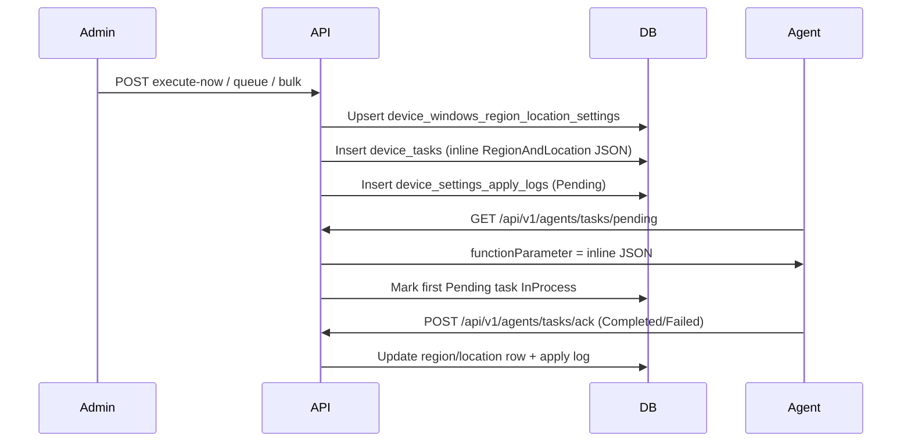

# Windows Region & Location — Operations Guide

## 1. Overview

Intellinode exposes REST APIs for **Windows Region & Location** on **Windows `:XP` devices only** (v1). Admins configure **geographic location** and **language/locale** — the FusionX **System Settings → Time and Language → Region and Location** tab.

| Concept | Value |
|---------|-------|
| FusionX UI | System Settings → **Time and Language** → Region and Location |
| FusionX `module_name` | `Region And Location Settings` (exact string) |
| Desired storage | `device_windows_region_location_settings` (1 row/device) |
| Settings kind (apply logs) | `WindowsRegionLocation` |
| Reference data | PR1 `GET .../reference/locations` and `GET .../reference/regions` |

This module does **not** set regional date/time format strings (PR4 — Regional Settings).

---

## 2. FusionX parity

| Item | Value |
|------|-------|
| Agent struct | `WinCELinux.RegionAndLocation` |
| Payload wrapper | `{ "WinCELinux": { "RegionAndLocation": { ... } } }` |
| Instant function | `"Now"` |
| Queued function | `"Update"` |
| Signal suffix (default) | `RLS` → `extra_data` = `{mac}&RLS` |
| Payload delivery | **Inline JSON** in `device_tasks.function_parameter` (≤512 chars) |
| `TaskID` in payload | Legacy numeric task id (`device_tasks.legacy_task_id`) |
| `AgentAction` | From request `execution.agentAction` (default `0`) |

**Example payload:**

```json
{
  "WinCELinux": {
    "RegionAndLocation": {
      "GeoID": 244,
      "Location": "United States",
      "BCP47Code": "en-US",
      "LanguageCode": 1033,
      "LanguageDescription": "English (United States)",
      "TaskID": 44,
      "AgentAction": 0
    }
  }
}
```

---

## 3. API reference (admin)

Base path: `/api/v1/admin/device-config/windows-region-location`

| Method | Path | Description |
|--------|------|-------------|
| GET | `/{macAddress}` | Current desired settings + version/apply status |
| GET | `/apply-history/{macAddress}` | Apply history (`status`, `page`, `pageSize`, `fromUtc`, `toUtc`) |
| POST | `/execute-now` | Instant apply (`scheduleType`: `InstantApply`) |
| POST | `/queue` | Scheduled apply (`scheduleType`: `Queue`) |
| POST | `/execute-now/bulk` | Instant apply same settings to many MACs |
| POST | `/execute-now/group/{groupId}` | Instant apply to active group members |

**Common error codes**

| Code | HTTP | Meaning |
|------|------|---------|
| `FeatureDisabled` | 404 | `WindowsRegionLocation:Enabled=false` or `ReadOnly=true` on writes |
| `DeviceNotFound` | 404 | MAC not enrolled in tenant |
| `ApplyBlocked` | 409 | Pending/InProcess task for `Region And Location Settings`, or enrollment not managed |
| `ValidationFailed` | 400 | FluentValidation, invalid master row, geo id 39070/World, or payload >512 chars |
| `GroupNotFound` | 404 | Group id invalid (group endpoints only) |
| `LegacyBehaviorExecutionFailed` | 502 | Unexpected service error |

**Apply blocking:** A pending **Region And Location Settings** task blocks another apply for the same module. It does **not** block DateTime, TimeZone, TimeServerSynchro, or other modules.

Bulk and group endpoints return **HTTP 200** when orchestration succeeds, even if some targets are blocked.

---

## 4. Configuration (`appsettings.json` → `WindowsRegionLocation`)

| Setting | Default | Purpose |
|---------|---------|---------|
| `Enabled` | `true` | Master switch |
| `ReadOnly` | `false` | Blocks writes (execute-now, queue, bulk, group) |
| `LegacySummaryEnabled` | `true` | FusionX HTML summary in responses |
| `DefaultSignalSuffix` | `RLS` | `extra_data` = `{mac}&RLS` |

---

## 5. Agent pipeline



---

## 6. Validation rules

| Field | Rules |
|-------|-------|
| `geoId` | Required, > 0; must exist in `region_and_location_master` with `Identifier='L'`, `IsActive=true`; **not** id `39070` / World |
| `locationName` | Required, max 200; must match master `Value` for selected geo id |
| `languageCode` | Required, > 0; must match active `Identifier='R'` master row id |
| `bcp47Code` | Required, max 20, BCP47-style tag (e.g. `en-US`); must match master row for `languageCode` |
| `languageDescription` | Required, max 200; must match master `Value` for selected region id |

- MAC must include `:XP` suffix; `osType` must be `XP`.
- Serialized payload must be ≤512 characters.

Use PR1 reference APIs to pick valid location/region pairs before apply.

---

## 7. Database

Table: `intellinode.device_windows_region_location_settings`

Key columns: `geo_id`, `location_name`, `language_code`, `bcp47_code`, `language_description`, `agent_action`, `settings_version`, `pending_apply`, `last_applied_*`, `last_apply_status`, `last_apply_message`.

Apply logs use `SettingsKind.WindowsRegionLocation`.

---

## 8. Related docs

- [Time and Language overview](./time-and-language-overview.md) — PR roadmap and reference APIs
- [Windows Date & Time Setup](./windows-date-time-setup-operations.md) — PR2 (independent pending-task blocking)
- [Windows Regional Format](./windows-regional-format-operations.md) — PR4 (date/time display patterns)
