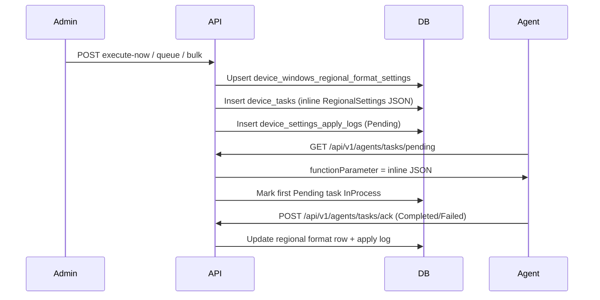

# Windows Regional Format — Operations Guide

## 1. Overview

Intellinode exposes REST APIs for **Windows Regional Format** (date/time display patterns) on **Windows `:XP` devices only** (v1). Admins configure **short/long date formats**, **time format**, **AM/PM symbols**, and **separators** — the FusionX **System Settings → Time and Language → Date & Time Format** tab.

| Concept | Value |
|---------|-------|
| FusionX UI tab | **Date & Time Format** |
| FusionX `module_name` | `Regional Settings` (exact string) |
| Desired storage | `device_windows_regional_format_settings` (1 row/device) |
| Settings kind (apply logs) | `WindowsRegionalFormat` |
| Format presets (optional) | `GET .../time-and-language/reference/format-presets` |

This module does **not** set geographic location or language locale (PR3) or clock/time zone/NTP (PR2). Currency format (FusionX `IsCurrency` path) is out of scope for v1.

---

## 2. FusionX parity

| Item | Value |
|------|-------|
| Agent struct | `WinCELinux.RegionalSettings` |
| Payload wrapper | `{ "WinCELinux": { "RegionalSettings": { ... } } }` |
| Instant function | `"Now"` |
| Queued function | `"Update"` |
| Signal suffix (default) | `RS` → `extra_data` = `{mac}&RS` |
| Payload delivery | **Inline JSON** in `device_tasks.function_parameter` (≤512 chars) |
| `TaskID` in payload | Legacy numeric task id (`device_tasks.legacy_task_id`) |
| `AgentAction` | From request `execution.agentAction` (default `0`) |

**FusionX property spelling (mandatory in agent JSON):**

| Agent JSON key | Request field | Notes |
|----------------|---------------|-------|
| `strTimeFormat` | `timeFormat` | e.g. `HH:mm:ss` |
| `strTimeSeperator` | `timeSeparator` | FusionX spelling **Seperator** |
| `strAMsymbol` | `amSymbol` | e.g. `AM` |
| `strPMsymbol` | `pmSymbol` | e.g. `PM` |
| `strMinyear` | *(always `""`)* | Not configurable in v1 |
| `strMaxyear` | *(always `""`)* | Not configurable in v1 |
| `strShortDateFormat` | `shortDateFormat` | e.g. `dd/MM/yyyy` |
| `strDateSeperator` | `dateSeparator` | FusionX spelling **Seperator** |
| `strLongDateFormat` | `longDateFormat` | e.g. `dddd, MMMM dd, yyyy` |
| `strShortDateSample` | `shortDateSample` | Preview string sent to agent |
| `strLongDateSample` | `longDateSample` | Preview string sent to agent |

`timeSample` is stored on the entity for UI preview only — **not** included in the agent payload.

**Example payload:**

```json
{
  "WinCELinux": {
    "RegionalSettings": {
      "strTimeFormat": "HH:mm:ss",
      "strTimeSeperator": ":",
      "strAMsymbol": "AM",
      "strPMsymbol": "PM",
      "strMinyear": "",
      "strMaxyear": "",
      "strShortDateFormat": "dd/MM/yyyy",
      "strDateSeperator": "/",
      "strLongDateFormat": "dddd, MMMM dd, yyyy",
      "strShortDateSample": "11/06/2026",
      "strLongDateSample": "Thursday, June 11, 2026",
      "TaskID": 45,
      "AgentAction": 0
    }
  }
}
```

---

## 3. API reference (admin)

Base path: `/api/v1/admin/device-config/windows-regional-format`

| Method | Path | Description |
|--------|------|-------------|
| GET | `/{macAddress}` | Current desired settings + version/apply status |
| GET | `/apply-history/{macAddress}` | Apply history (`status`, `page`, `pageSize`, `fromUtc`, `toUtc`) |
| POST | `/execute-now` | Instant apply (`scheduleType`: `InstantApply`) |
| POST | `/queue` | Scheduled apply (`scheduleType`: `Queue`) |
| POST | `/execute-now/bulk` | Instant apply same settings to many MACs |
| POST | `/execute-now/group/{groupId}` | Instant apply to active group members |

**Reference helper:** `GET /api/v1/admin/device-config/time-and-language/reference/format-presets` — static common format tokens (no DB).

**Common error codes**

| Code | HTTP | Meaning |
|------|------|---------|
| `FeatureDisabled` | 404 | `WindowsRegionalFormat:Enabled=false` or `ReadOnly=true` on writes |
| `DeviceNotFound` | 404 | MAC not enrolled in tenant |
| `ApplyBlocked` | 409 | Pending/InProcess task for `Regional Settings`, or enrollment not managed |
| `ValidationFailed` | 400 | FluentValidation or payload >512 chars |
| `GroupNotFound` | 404 | Group id invalid (group endpoints only) |
| `LegacyBehaviorExecutionFailed` | 502 | Unexpected service error |

**Apply blocking:** A pending **Regional Settings** task blocks another apply for the same module. It does **not** block PR2 date/time modules or PR3 region/location tasks.

Bulk and group endpoints return **HTTP 200** when orchestration succeeds, even if some targets are blocked.

---

## 4. Configuration (`appsettings.json` → `WindowsRegionalFormat`)

| Setting | Default | Purpose |
|---------|---------|---------|
| `Enabled` | `true` | Master switch |
| `ReadOnly` | `false` | Blocks writes (execute-now, queue, bulk, group) |
| `LegacySummaryEnabled` | `true` | FusionX HTML summary in responses |
| `DefaultSignalSuffix` | `RS` | `extra_data` = `{mac}&RS` |

---

## 5. Agent pipeline



---

## 6. Validation rules

| Field | Rules |
|-------|-------|
| `timeFormat` | Required, max 50 chars |
| `timeSeparator` | Required, 1–5 chars |
| `amSymbol` / `pmSymbol` | Required, max 10 chars each |
| `shortDateFormat` | Required, max 50 chars |
| `dateSeparator` | Required, 1–5 chars |
| `longDateFormat` | Required, max 100 chars |
| `shortDateSample` | Required, max 50 chars |
| `longDateSample` | Required, max 100 chars |
| `timeSample` | Optional, max 50 chars (stored only) |

- MAC must include `:XP` suffix; `osType` must be `XP`.
- Serialized payload must be ≤512 characters.

---

## 7. Database

Table: `intellinode.device_windows_regional_format_settings`

Key columns: `time_format`, `time_separator`, `am_symbol`, `pm_symbol`, `short_date_format`, `date_separator`, `long_date_format`, `short_date_sample`, `long_date_sample`, `time_sample`, `agent_action`, `settings_version`, `pending_apply`, `last_applied_*`, `last_apply_status`, `last_apply_message`.

Apply logs use `SettingsKind.WindowsRegionalFormat`.

---

## 8. Related docs

- [Time and Language overview](./time-and-language-overview.md) — PR roadmap (PR1–PR4 complete for Windows v1)
- [Windows Date & Time Setup](./windows-date-time-setup-operations.md) — PR2
- [Windows Region & Location](./windows-region-location-operations.md) — PR3
