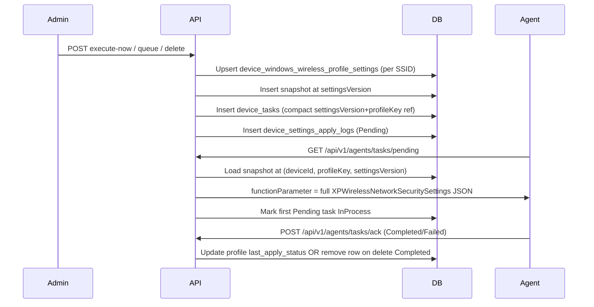

# Windows Wireless Properties — Operations Guide

## 4.1 Overview

Intellinode exposes REST APIs for **Windows Wireless Properties** on **Windows `:XP` devices only** (v1). Admins configure WiFi security profiles (SSID, authentication, encryption, keys) via JSON that mirrors FusionX `XPWirelessNetworkSecuritySettings` field names.

**FusionX parity**

| Concept | Value |
|---------|-------|
| FusionX UI | Network Settings → **Wireless Properties** (not Wireless Setup / IP) |
| Module name | `Wireless Network Security` |
| Instant function | `Now` |
| Queued function | `Update` |
| Agent signal (`extra_data`) | `{macAddress}&WNS` (configurable suffix) |
| Wrapper key | `WinCELinux.XPWirelessNetworkSecuritySettings` |

**ADR Option B (binding):** Full settings live in `device_windows_wireless_profile_settings.settings_json` (JSONB, one row per SSID/profile). Task rows store a compact reference `{"settingsVersion":N,"profileKey":K}` in `device_tasks.function_parameter`. The server **hydrates** the full `{"WinCELinux":{"XPWirelessNetworkSecuritySettings":{...}}}` payload when the agent polls pending tasks.

**Multi-profile:** A device may have multiple SSIDs configured concurrently. Each add/update/delete queues **one SSID per task**. Pending-task blocking is **per module per device** (not per SSID) — only one pending `Wireless Network Security` task at a time.

See [ADR-0003](adr/0003-windows-wireless-properties-payload-strategy.md) for measured payload sizes (max realistic ~780 chars → hydration required).

---

## 4.2 API reference (admin)

Base path: `/api/v1/admin/device-config/windows-wireless-properties`

| Method | Path | Description |
|--------|------|-------------|
| GET | `/{macAddress}` | List all profiles (**keys redacted** on GET) |
| GET | `/{macAddress}/profiles/{ssid}` | Single profile by SSID (URL-encode SSID if needed) |
| GET | `/apply-history/{macAddress}` | Apply history (module-scoped; optional `status`, `page`, `pageSize`) |
| POST | `/execute-now` | Instant add or update (`operation`: `Add` / `Update`) |
| POST | `/queue` | Scheduled add or update |
| POST | `/delete/execute-now` | Instant delete one SSID |
| POST | `/delete/queue` | Scheduled delete one SSID |
| POST | `/execute-now/bulk` | Instant apply same profile (Add/Update) to many MACs |
| POST | `/execute-now/group/{groupId}` | Instant apply same profile to active group members |
| POST | `/delete/execute-now/bulk` | Instant delete same SSID on many MACs |
| POST | `/delete/execute-now/group/{groupId}` | Instant delete same SSID on active group members |

**Common error codes**

| Code | HTTP | Meaning |
|------|------|---------|
| `FeatureDisabled` | 404 | `WindowsWirelessProperties:Enabled=false` or `ReadOnly=true` on writes |
| `DeviceNotFound` | 404 | MAC not enrolled in tenant |
| `ProfileNotFound` | 404 | SSID not configured on device (update/delete/get) |
| `ProfileAlreadyExists` | 409 | Add requested for SSID that already exists |
| `ApplyBlocked` | 409 | Pending/InProcess `Wireless Network Security` task or enrollment not managed |
| `ValidationFailed` | 400 | FluentValidation or request shape failure |
| `LegacyBehaviorExecutionFailed` | 502 | Unexpected service error |
| `GroupNotFound` | 404 | Group id invalid (group endpoints only) |

Bulk and group endpoints return **HTTP 200** when orchestration succeeds, even if some targets are blocked (per-target `Results` carry `Blocked` + `Reason`).

---

## 4.2.1 Bulk & group apply

FusionX `WirelessProperties_Handler.ashx.cs` expands group/site selections into per-MAC `SaveWifiSetting` calls. Intellinode exposes explicit bulk/group REST endpoints with per-target `Results[]`.

**Rules**

- **InstantApply only** on bulk/group (no bulk queue in v1).
- **Max 500 targets** per bulk request (deduped by MAC).
- **One pending task per device per module** — bulk does not bypass `PendingTaskExists`; a device with a pending `Wireless Network Security` task blocks the next SSID until the first task is acked.
- **Group apply** includes only `EnrollmentState.Active` devices in the group. Non-`:XP` MAC suffixes return `Blocked` / `UnsupportedOsType`.

**Per-target block reasons**

| Reason | Meaning |
|--------|---------|
| `DeviceNotFound` | MAC not enrolled |
| `UnsupportedOsType` | MAC suffix is not `:XP` |
| `EnrollmentStateBlocked` | Device not in managed `Active` enrollment |
| `PendingTaskExists` | Pending/InProcess `Wireless Network Security` task on device |
| `ProfileAlreadyExists` | Add requested for SSID already on device |
| `ProfileNotFound` | Update/delete requested for SSID not on device |

**Example partial-success response**

```json
{
  "success": true,
  "message": "Bulk execute-now accepted.",
  "data": {
    "taskId": "3fa85f64-5717-4562-b3fc-2c963f66afa6",
    "totalTargets": 2,
    "accepted": 1,
    "blocked": 1,
    "results": [
      { "macAddress": "AA:BB:CC:DD:EE:11:XP", "status": "Pending", "ssid": "Corp-WiFi", "profileKey": 42 },
      { "macAddress": "AA:BB:CC:DD:EE:12:XP", "status": "Blocked", "reason": "PendingTaskExists" }
    ]
  }
}
```

---

## 4.3 Configuration (`appsettings.json` → `WindowsWirelessProperties`)

| Setting | Default | Purpose |
|---------|---------|---------|
| `Enabled` | `true` | Master switch |
| `ReadOnly` | `false` | Blocks writes (execute-now, queue, delete) |
| `LegacySummaryEnabled` | `true` | FusionX HTML summary in responses |
| `DefaultSignalSuffix` | `WNS` | Appended to `extra_data` as `{mac}&{suffix}` |

---

## 4.4 Agent pipeline



**Numbered flow**

1. Admin queues work → DB stores compact `function_parameter` and snapshot at queued version.
2. Agent polls `GET /api/v1/agents/tasks/pending` → server hydrates full JSON from **snapshot** (includes `strNetworkKey` / `strNetworkPPK`).
3. Agent applies profile on device (add/update/delete per SSID).
4. Agent acks `POST /api/v1/agents/tasks/ack`:
   - **Add/Update Completed** → `pending_apply=false`, `last_applied_version` set, apply log `Applied`.
   - **Delete Completed** → profile row **removed** from `device_windows_wireless_profile_settings`.
   - **Failed** → profile row retained; `last_apply_status=Failed` with truncated reason.

---

## 4.5 Troubleshooting

| Symptom | Likely cause | Action |
|---------|--------------|--------|
| Agent gets compact ref not full JSON | Hydration failed | Check snapshot row for `(deviceId, profileKey, settingsVersion)`; verify task `function_parameter` parses |
| `ApplyBlocked` / `PendingTaskExists` | Pending/InProcess `Wireless Network Security` task | Wait for agent ack; one pending task per device per module |
| `ProfileAlreadyExists` on add | SSID already in DB | Use `operation: Update` instead |
| `ProfileNotFound` on update/delete | SSID not configured | Add profile first or verify SSID spelling/casing |
| GET shows `********` but device needs key | Expected redaction on admin GET | DB `settings_json` has real keys; agent receives hydrated payload with secrets |
| Delete ack completed but SSID still listed | Ack not processed or wrong module | Verify `moduleName=Wireless Network Security` and delete snapshot is SSID-only shape |
| Second SSID blocked while first pending | Module-level pending block | By design — complete or fail first task before queuing another SSID |
| Hydrated payload has old key after admin update | Snapshot binding | Task is bound to `settingsVersion` at queue time; newer live row is ignored until new task |

---

## 4.6 SQL debugging snippets

```sql
-- Profile rows (one per SSID)
SELECT profile_key, ssid, settings_version, pending_apply, last_apply_status, last_applied_version
FROM intellinode.device_windows_wireless_profile_settings
WHERE device_id = '...'
ORDER BY ssid;

-- Snapshots for hydration
SELECT profile_key, settings_version, created_utc
FROM intellinode.device_windows_wireless_profile_settings_snapshots
WHERE device_id = '...'
ORDER BY created_utc DESC;

-- Pending wireless tasks
SELECT id, module_name, function_name, function_parameter, status, extra_data, created_utc
FROM intellinode.device_tasks
WHERE device_id = '...' AND module_name = 'Wireless Network Security'
ORDER BY created_utc DESC;

-- Apply logs
SELECT settings_kind, settings_version, apply_mode, status, message, task_id, created_utc
FROM intellinode.device_settings_apply_logs
WHERE device_id = '...' AND settings_kind = 'WindowsWirelessProperties'
ORDER BY created_utc DESC;
```

---

## 4.7 Security notes

- Admin **GET** redacts `strNetworkKey` and `strNetworkPPK` (`********`); write path and agent hydration include real credentials in `settings_json`.
- Recommend **TDE/encryption at rest** for production PostgreSQL (implementation deferred).
- **Stale version race:** task is bound to `settingsVersion` + `profileKey` at queue time; hydrator prefers snapshot over live row when versions diverge.

---

## 4.8 FusionX parity appendix

**Struct fields** (`XPWirelessNetworkSecuritySettings`):

| Field | FusionX / Intellinode |
|-------|----------------------|
| `strNetworkSSDIName` | SSID (max 128) |
| `strNetworkAuthentication` | e.g. `No authentication (Open)`, `WPA2-Personal`, `WPA2-Enterprise` |
| `strNetworkDataEncr` | `None`, `AES`, etc. |
| `strNetworkKey` | WEP/Shared/WPA-Personal key (max 100) |
| `strNetworkPPK` | Pre-shared key (max 100) |
| `iNetworkKeyIndex` | 1–4 for keyed profiles; 0 for Open |
| `strNetworkName` | Network name (max 50) |
| `Conn_Auto_WhenIn_Range` | Auto-connect when in range |
| `Text1` | `"true"` / `"false"` — connect to non-broadcasting network |
| `strStatus` | Empty on add/update in FusionX |

**Delete payload:** SSID-only inner JSON — only `strNetworkSSDIName` populated; auth/encryption/key fields empty.

**Open questions (confirm with agent team before production rollout):**

1. Signal suffix — schedule code uses `{mac}&WNS`; delete UI popup references `XPWIFI`.
2. Delete payload — Is SSID-only struct sufficient without `strStatus` discriminator?
3. Module name — exact match required for `"Wireless Network Security"`?
4. `Text1` semantics — FusionX maps non-broadcast checkbox to `"true"`/`"false"` string.

See [ADR-0003 appendix](adr/0003-windows-wireless-properties-payload-strategy.md) for full open-question list.

---

## 4.9 Explicitly deferred (v2+)

- **Bulk / group queue** (scheduled bulk apply)
- **SysView / template library** (site/group WiFi templates — stretch 5B)
- Linux Wireless Properties (`:LX`, `:CE`)
- SysView / template library
- Widening `device_tasks.function_parameter` column (Option A fallback)

---

## 4.10 Related documentation

- [ADR-0003: Windows Wireless Properties Agent Payload Strategy](adr/0003-windows-wireless-properties-payload-strategy.md)
- HTTP samples: `src/Intellinode.Api/Intellinode.Api.http` (Windows Wireless Properties section, ~line 2739)
