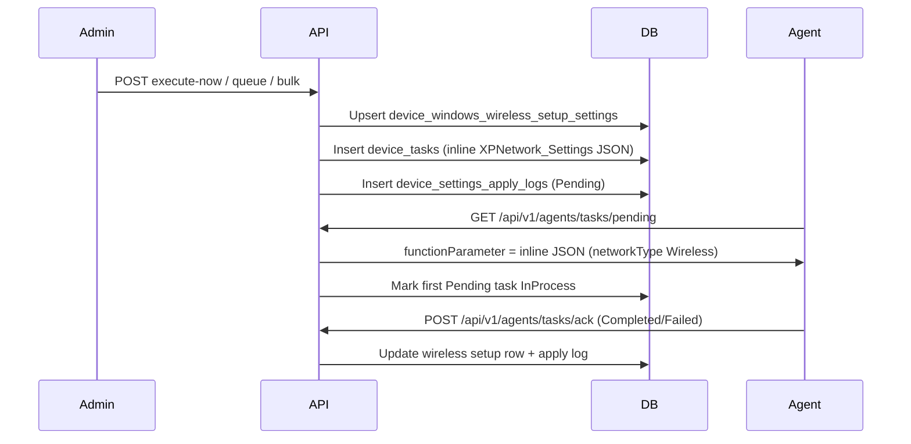

# Windows Wireless Setup — Operations Guide

## 1. Overview

Intellinode exposes REST APIs for **Windows Wireless Setup** on **Windows `:XP` devices only** (v1). Admins configure Wi‑Fi **IP/DHCP** settings (static IP, subnet, gateway, DNS/WINS) — the FusionX **Network Settings → Wireless Setup** screen.

**Do not confuse with Wireless Properties** (SSID/security — separate module).

| Concept | Wireless Setup (this doc) | Wireless Properties |
|---------|---------------------------|---------------------|
| FusionX UI | Network Settings → **Wireless Setup** | Network Settings → **Wireless Properties** |
| Purpose | Wi‑Fi IP / DHCP | SSID, auth, encryption, keys |
| Module name | `Wireless` | `Wireless Network Security` |
| Agent struct | `WinCELinux.XPNetwork_Settings` | `WinCELinux.XPWirelessNetworkSecuritySettings` |
| `networkType` | `"Wireless"` | N/A |
| Signal (`extra_data`) | `{macAddress}&W` | `{macAddress}&WNS` |
| Payload delivery | **Inline JSON** in `function_parameter` (≤512 chars) | Compact ref + **hydration** on agent poll |
| Desired storage | `device_windows_wireless_setup_settings` (1 row/device) | `device_windows_wireless_profile_settings` (1 row/SSID) |
| Settings kind | `WindowsWirelessSetup` | `WindowsWirelessProperties` |

---

## 2. FusionX parity

| Item | Value |
|------|-------|
| FusionX UI | Network Settings → **Wireless Setup** (IP/DHCP) |
| Agent struct | `WinCELinux.XPNetwork_Settings` |
| `networkType` in payload | `"Wireless"` |
| Task `module_name` | `"Wireless"` |
| Instant function | `"Now"` |
| Queued function | `"Update"` |
| Signal (`extra_data`) | `{macAddress}&W` |
| Payload | Inline JSON in `device_tasks.function_parameter` (≤512 chars) — same pattern as Ethernet |

**Inline payload (no hydration):** Unlike Wireless Properties, the full agent JSON is stored directly in `function_parameter` when the task is queued. The agent receives it verbatim on poll.

---

## 3. API reference (admin)

Base path: `/api/v1/admin/device-config/windows-wireless-setup`

| Method | Path | Description |
|--------|------|-------------|
| GET | `/{macAddress}` | Current desired settings + v1 reported stub |
| GET | `/apply-history/{macAddress}` | Apply history (optional `status`, `page`, `pageSize`) |
| POST | `/execute-now` | Instant apply (`scheduleType`: `InstantApply`) |
| POST | `/queue` | Scheduled apply (`scheduleType`: `Queue`) |
| POST | `/execute-now/bulk` | Instant apply same settings to many MACs |
| POST | `/execute-now/group/{groupId}` | Instant apply to active group members |

**Common error codes**

| Code | HTTP | Meaning |
|------|------|---------|
| `FeatureDisabled` | 404 | `WindowsWirelessSetup:Enabled=false` or `ReadOnly=true` on writes |
| `DeviceNotFound` | 404 | MAC not enrolled in tenant |
| `ApplyBlocked` | 409 | Pending/InProcess `Wireless` task or enrollment not managed |
| `ValidationFailed` | 400 | FluentValidation, duplicate IP, payload too large, or `NoReportedIpAddress` |
| `GroupNotFound` | 404 | Group id invalid (group endpoints only) |
| `LegacyBehaviorExecutionFailed` | 502 | Unexpected service error |

Bulk and group endpoints return **HTTP 200** when orchestration succeeds, even if some targets are blocked (per-target `Results` carry `Blocked` + `Reason`).

---

## 4. Configuration (`appsettings.json` → `WindowsWirelessSetup`)

| Setting | Default | Purpose |
|---------|---------|---------|
| `Enabled` | `true` | Master switch |
| `ReadOnly` | `false` | Blocks writes (execute-now, queue, bulk, group) |
| `LegacySummaryEnabled` | `true` | FusionX HTML summary in responses |
| `DefaultSignalSuffix` | `W` | Appended to `extra_data` as `{mac}&{suffix}` |
| `ValidateDuplicateIp` | `true` | Reject manual IP already used in `device_windows_wireless_setup_settings` |
| `RequireWirelessAdapter` | `false` | Reserved — no wireless adapter inventory in v1 |

---

## 5. Agent pipeline



**Numbered flow**

1. Admin queues work → service upserts `device_windows_wireless_setup_settings`, increments `settings_version`, sets `pending_apply=true`.
2. Service inserts `device_tasks` with `module_name=Wireless`, `function_name=Now` or `Update`, inline `function_parameter`, and `extra_data={mac}&W`.
3. Agent polls pending tasks → receives full inline JSON (no hydration step).
4. Agent applies Wi‑Fi IP/DHCP on device.
5. Agent acks Completed/Failed → `WindowsWirelessSetupTaskAckHandler` updates desired row and writes apply log (`SettingsKind.WindowsWirelessSetup`).

---

## 6. Bulk & group rules

- **InstantApply only** on bulk/group (no bulk queue in v1).
- **Max 500 targets** per bulk request (deduped by MAC).
- **One pending task per device per module** — bulk does not bypass `PendingTaskExists` for module `Wireless`. Ethernet (`Ethernet`) and Wireless Properties (`Wireless Network Security`) are tracked independently.
- **Group apply** includes only `EnrollmentState.Active` devices in the group. Non-`:XP` MAC suffixes return `Blocked` / `UnsupportedOsType`.
- **Bulk manual without template IP:** v1 blocks with `NoReportedIpAddress` (no per-device reported wireless IP inventory yet). Use explicit `ipAddress` per single-target requests, or use DHCP for bulk/group.

**Per-target block reasons**

| Reason | Meaning |
|--------|---------|
| `DeviceNotFound` | MAC not enrolled |
| `UnsupportedOsType` | MAC suffix is not `:XP` |
| `EnrollmentStateBlocked` | Device not in managed `Active` enrollment |
| `PendingTaskExists` | Pending/InProcess `Wireless` task on device |
| `NoReportedIpAddress` | Manual mode without IP (bulk/group or missing template IP) |
| `DuplicateIpInRequest` | Same IP twice in one bulk request |
| Duplicate IP message | IP already on another device's wireless setup row |

---

## 7. Troubleshooting

| Symptom | Likely cause | Action |
|---------|--------------|--------|
| `ApplyBlocked` / `PendingTaskExists` | Pending/InProcess `Wireless` task | Wait for agent ack; one pending task per device per module |
| Second wireless setup blocked while ethernet pending | By design | Modules are independent — check `module_name` on pending tasks |
| Confused with Wireless Properties | Wrong API path | Setup = `/windows-wireless-setup`; Properties = `/windows-wireless-properties` |
| `ValidationFailed` duplicate IP | IP on another device | Query `device_windows_wireless_setup_settings.ip_address` |
| Payload too large | Manual config exceeds 512 chars | Reduce field lengths or use DHCP |
| `data.reported.isAvailable=false` always | v1 stub | Reported wireless state deferred to future inventory PR |
| Bulk manual multi-target blocked | No reported IP fallback | Provide explicit IP (single target) or use DHCP bulk |
| Agent gets empty/wrong JSON | Wrong module | Verify `module_name=Wireless`, not `Wireless Network Security` |

---

## 8. SQL debugging snippets

```sql
-- Desired wireless IP/DHCP settings (one row per device)
SELECT device_id, is_dhcp, ip_address, subnet_mask, gateway,
       primary_dns, secondary_dns, settings_version, pending_apply,
       last_applied_version, last_apply_status, last_apply_message
FROM intellinode.device_windows_wireless_setup_settings
WHERE device_id = '...';

-- Pending wireless setup tasks
SELECT id, module_name, function_name, function_parameter, status, extra_data, created_utc
FROM intellinode.device_tasks
WHERE device_id = '...' AND module_name = 'Wireless'
ORDER BY created_utc DESC;

-- Apply logs
SELECT settings_kind, settings_version, apply_mode, status, message, task_id, created_utc
FROM intellinode.device_settings_apply_logs
WHERE device_id = '...' AND settings_kind = 'WindowsWirelessSetup'
ORDER BY created_utc DESC;
```

---

## 9. v1 limitations

- **Reported wireless state** is a stub (`isAvailable=false`, empty fields) until wireless adapter inventory is implemented.
- **Bulk manual without template IP** is blocked (`NoReportedIpAddress`) — unlike Ethernet, which can use each device's reported IP for multi-target manual apply.
- **RequireWirelessAdapter** option exists but is not enforced (no inventory).
- No bulk **queue** endpoint (instant-only bulk/group, same as Ethernet).

---

## 10. Related docs

- [Windows Wireless Properties — Operations Guide](windows-wireless-properties-operations.md) — SSID/security profiles (separate module).
- Inline payload strategy matches **Windows Ethernet Setup** (no ADR required for hydration).

---

## 11. FusionX parity appendix (`XPNetwork_Settings`)

| Field | FusionX / Intellinode |
|-------|----------------------|
| `MacAddr` | Device MAC with `:XP` suffix |
| `DHCP` | `true` / `false` |
| `IPAddr` | Static IP (empty when DHCP) |
| `SubnetMask` | Subnet mask |
| `Gateway` | Default gateway |
| `PriDNS` / `SecDNS` | Primary/secondary DNS |
| `PriWNS` / `SecWNS` | Primary/secondary WINS |
| `networkType` | `"Wireless"` (Setup) vs `"Ethernet"` |
| `TaskID` | Legacy task id (agent uses queued value) |
| `AgentAction` | From request `execution.agentAction` |

**Not included for Wireless Setup:** `networkSpeed`, `IsObtainedDNSAutomatically` (Ethernet-only FusionX fields).
